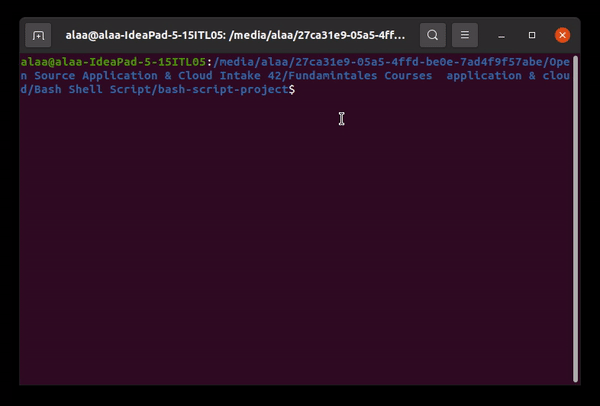

# Database management system 

---

Useing a bash script that allows the following:

1- Create, Delete, Open and list available databases.

2- Open, Drop and List all tables in a certain database.

3- Insert and Delete from a record.

4- Update a record or certain cell.

5- Show a specific table structure and content.

---

## ▶️ Demo

---

